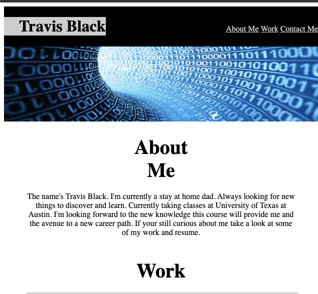

# Travis-Portfolio

## Description

Professional Portfolio of my acheviments in the computer science field. This includes websites that I have designed and deployed. It will also include information about me and my resume.

## Installation guide

N/A

## Usage

Access site: http://travisjblack.github.io/Travis-Portfolio

 

The nav links allows you to jump to that section of the page.

 

The section shows websites that I have either helped create or created on my own. The first and second one are active links to the websites.

 

The contact section is ways to get ahold of me or access information about me. 